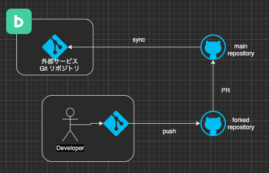

#### 概要

そんな構成ふつうはないやろ・・という話なのですが，
メインリポジトリの他に，メインリポジトリとリアルタイムに同期する外部 Git リポジトリが必要になったとします．  
※ うちの院の先生が PBL の評価対象にみなすのは，あくまで学校が契約している Back○log のリポジトリとか言うので・・



こんな感じの構成があったとして．  
`sync` 部分を GitHub Actions で連携部分を作ったときにちょこっとハマったので，メモです．

#### 用意するもの

* GitHub リポジトリ(main)
* GitHub リポジトリ(forked: 作業用)
* Backlog Git リポジトリ
* Backlog リポジトリの git-credential(連携用)

#### GitHub Actions 設定

main リポジトリに `sync` 用の GitHub Actions を設定します．  
動作環境は，ubuntu-latest にしました．

```
jobs:
  push-backlog-git:
    name: Push Backlog Git
    runs-on: ubuntu-latest

    steps:
    - name: Checkout Code
      uses: actions/checkout@v2
      with: 
        fetch-depth: 0
```

`actions/checkout` には `fetch-depth: 0` を指定します．  
このオプションは checkout のデフォルト値が 1 となっているため，なにも指定しないと shallow copy として作成されてしまいます．  
※ これに超ハマりました．

`sync` している部分は `git remote add` で追加して，強制的に上書きしています．

```
    - name: git setting
      run: |
        echo ${{ secrets.PUSH_BACKLOG_GIT_CREDENTIAL  }} > ~/.git-credentials
        git config credential.helper store
        git config remote.origin.fetch "+refs/heads/*:refs/remotes/origin/*"
        git remote add backlog https://{your organization}.backlog.jp/git/{your project}/{yout repository}.git
    - name: Sync with Backlog
      run: |
        git fetch
        git push --force --all backlog
```

Backlog のアカウントは PUSH_BACKLOG_GIT_CREDENTIAL をキーに GitHub の Secret 機能で管理しています．  
ここでは ssh 鍵ではなく，git-credential で認証するようにしました．  

credential については Git のドキュメントを参照するのがよいでしょう．  
[7.14 Git のさまざまなツール - 認証情報の保存](https://git-scm.com/book/ja/v2/Git-のさまざまなツール-認証情報の保存)

