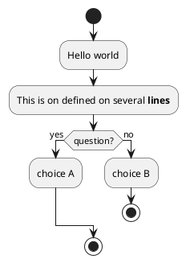
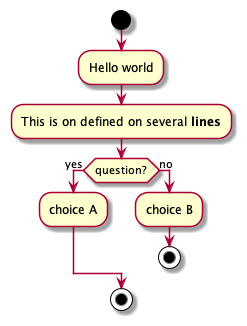
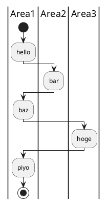
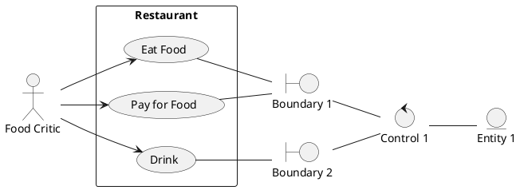
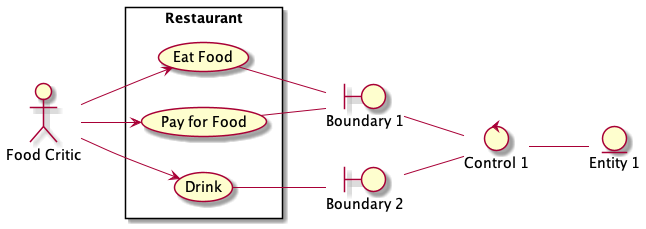
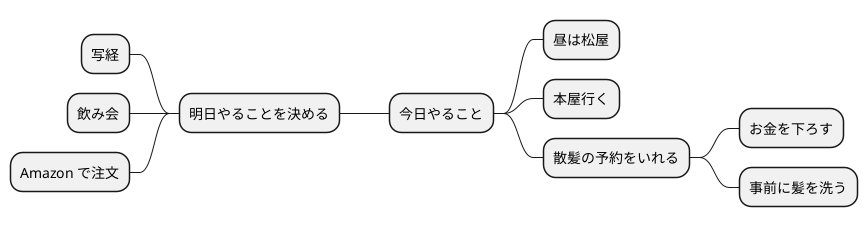
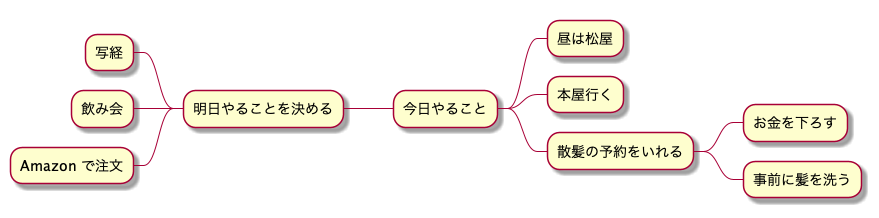

### First(UML 書いてますか？)

職業柄，UML はけっこう書く．  
図をあれこれ書こうと思うと，結局，一番有用なんですよね．  
読める人には誰でも伝わるし．
カチッと書けているかとけっこう怪しい気はするんだけど．  

んで，ちょっと前までは Astah* 派だったんですけど，最近は .md とセットで書くことが増えてきて
なら，テキストベースでさくっと書ける PlantUML のほうがいいんじゃない？ ということで専ら PlantUML 派です．

本記事では普段の運用スタイル，各図の書き方とかを俺のために書いていきます．

### 書き方 

会社で使っている DocBase またはふだんづかいの Inkdrop を使います．  
Qiita が対応してないのはほんとになんとかしてほしいです・・  
以下のような感じで書いていきます．

```
｀｀｀plantuml
@startuml

@enduml
｀｀｀
```

※ 半角 Quote がうまくエスケープできませんでした・・どうやるんだろ・・

`` ` `` これはできたけども・・  
`` ``` `` これもできる  
https://yu8mada.com/2018/06/15/how-to-escape-a-backtick-or-a-backslash-inside-inline-code-in-markdown/

本記事では，公式ドキュメントみながらいくつか「これはどう書くんだろ？」みたいなのを書いてみようかと思います(たまに追加する感じ)．

### 参考になりそうなサイト

Real WORLD PlantUML  
https://real-world-plantuml.com  
PlantUML のサンプルがたくさんある．見た感じ，玉石混交っぽいので過信はできないが，「こんな用例ないかな〜？」と調べるにはよさそう．

### アクティビティ図

アクティビティ図はものごとを一連の手続きに分解し，表現するものです．  
ステートマシンとは使いどころが違うので注意が必要です．  
僕が新人の頃によく書かされたフローチャートに似ています．

おおよその書き方は公式のドキュメントが充実しています．  
https://plantuml.com/ja/activity-diagram-beta

よく使うのはこんな感じかしら
- 開始/終了 ノード
- アクション
- デシジョン/マージ
- パーティション





パーティションは切り替わるごとに指定のし直しが必要．




### シーケンス図

https://plantuml.com/ja/sequence-diagram

TBD

### ユースケース/ロバストネス図

https://plantuml.com/ja/use-case-diagram

ロバストネス図はユースケースを発展させて，ユースケースの背後に潜む バウンダリ/コントロール/エンティティ を分析したものです．  
以下の要領でユースケース図を拡張するかたちで記述できる．





### ステートマシン図

https://plantuml.com/ja/state-diagram

TBD

### コンポーネント図

https://plantuml.com/ja/component-diagram

TBD

### ER 図(おまけ)

UML ではないけれども PlantUML で有用に書けるので．  
https://plantuml.com/ja/ie-diagram


### その他

地味にタイミング図は組み込みの世界ではすごく有用なんじゃないかなぁと密かにおもっている．  
自分がその世界から離れてちょっと経ってしまっているので，なかなか書く機会がないんだけれども．

https://plantuml.com/ja/timing-diagram


マインドマップもアイデアとしては面白い．

https://plantuml.com/ja/mindmap-diagram






あと，この記事ここで終わりでまさかと思うかもしれませんが，実のところ，僕はクラス図には興味がないのです・・  
継承関係ってあまり実りのある関係性じゃないなとおもっているのと，ソフトウェアデザインで必要なものはだいたい
すでに取り上げた図でおよそカバーできるかなと思っている．

あとはまぁ，NW 図とかブロック図，DFD とかあるけども．  
この手のは PlantUML でがんばって書くより， Diagrams.net とか使ったほうがいいのではないかしら．
