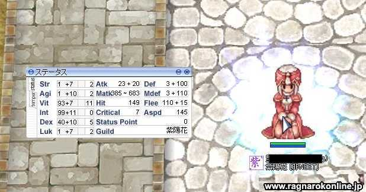

### Qiita 書いた

OpenAPI + Slack ネタで．  
なお，社内で Slack 投稿なら CircleCI 公式の Orb のほうがよさそうと
いう指摘をもらったのですが，Artifact の URL 取るのがちょっと面倒なので `moxci` 
で代用している側面があります．

**Stoplight + GitHub/CircleCI + Slack で OpenAPI Documentation 管理**
https://qiita.com/youknowcast/items/5647a17ea84cad8e3849

### 僕のネトゲ黄金時代

データ整理してたら，懐かしいものが出てきたので．  
ついでに旧ブログの記事とか復元しようと思ったのですが，内容があまりにもしょうもなさすぎて，これはこのまま寝ていていただこうということに・・

V-I 2 極の完全支援職でしたねぇ．  
ラグマスのほうはいまひとつノレてなくて全然やらなくなっちゃいました．
