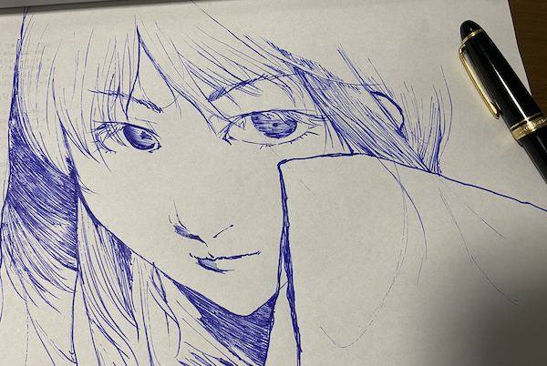

### Blog の更新ツールを WebStorm に切り替えた

[All Products Pack](https://www.jetbrains.com/ja-jp/all/) を契約してしまったので
貧乏性な僕は使えるものは全部使わないと，とおもってしまったのです．

### 部屋の模様替えをした

* Ergotron のアームを買ったので，今使ってる 34inch のモニタに適用してみたら結構いい感じになった
  * これを買った
    https://www.amazon.co.jp/gp/product/B07Q8TJ2KL
* やっと複数マシンで Realforce を使えるようにした
  * 有線接続なので，取り回しがしんどいんじゃよ・・
  * とくに工夫とかはなく，物理スイッチで切り替えられるようにしました https://www.amazon.co.jp/gp/product/B083JKDNRJ
* 社の業務マシン(MBP)を 34inch モニタで使えるようにした
  * 今まで使えなかったんかい，とつっこまれそうですが，なんか取り回しがうまくいかなくて，仕事は MBP のモニタだけでやってました
  * 長い社畜人生のおかげで，狭いモニタ一枚だけで仕事するのには悲しいことに慣れてしまったため，あまり不便を感じたことがなかった・・

### 5 年ぶりとかに線画描いたのでメモ

わかった(思い知った)こと
* 描かないと人は劣化する
* 万年筆は文字を書くものである(少なくとも俺にとっては)
* きれいな絵が描ける人は~~うらやましいにゃー~~偉大

(思ったけど，写真とかはそのうち，S3 のほうにあげてそっちを参照するように変えよう・・)
